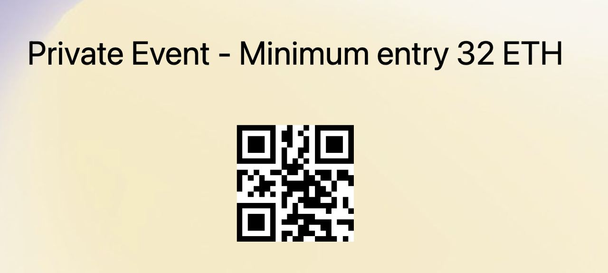

# ETH-Porto

Integrate an events app with [Sismo](https://docs.sismo.io/sismo-docs/) that
leverage user’s data with privacy in mind. This app enables users with specific
minimal requirements, like a minimal ethereum balance, to connect to a specific
event. At the same time, users can connect their wallet to our app without
leaking any private information like the wallet address, full balance, etc.

This way the app can guarantee that only the minimal eligeble users enter the
event without jeoperdizing clients private information.

Example application for the demo:




# How to run

Code of the demo is in `./app`:

```
cd app && yarn dev
# open http://localhost:3000
```

# Progress

```
./sismo-group
```

Allows verifying possession of 32, 64, 128 ETH on the Ethereum mainnet.
Merged in https://github.com/sismo-core/sismo-hub/pull/1535

```
./sismo-hub
```

Allows using Alchemy for verifying various claims about NFT.

Supports Ethereum, Polygon, Optimism, Arbitrum, Astar, Solana.

PR Open: https://github.com/sismo-core/sismo-hub/pull/1538
